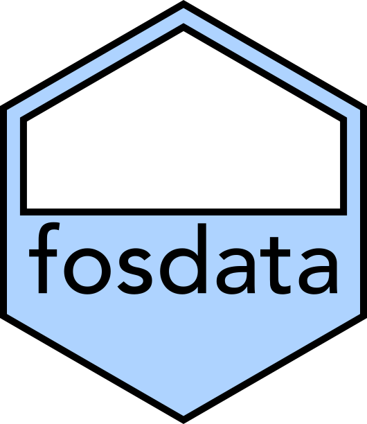

<!-- README.md is generated from README.Rmd. Please edit that file -->

```{r, include = FALSE}
knitr::opts_chunk$set(
  collapse = TRUE,
  comment = "#>",
  fig.path = "man/figures/README-",
  out.width = "75%",
  warning = FALSE,
  message = FALSE,
  fig.retina = 2,
  fig.align = 'center'
)
library(tidyverse)
library(fosdata)
```

# fosdata <a href='https://github.com/speegled/fosdata'></a>

<!-- badges: start -->
<!-- badges: end -->

The `fosdata` package contains datasets for the textbook [Foundations of Statistics with R](https://mathstat.slu.edu/~speegle/_book/) by Darrin Speegle and Bryan Clair.

## Installation

<!--You can install the released version of fosdata from [CRAN](https://CRAN.R-project.org) with:
``` r
install.packages("fosdata")
```
-->

You can install the development version from [GitHub](https://github.com/) with:

``` r
# install.packages("remotes")
remotes::install_github("speegled/fosdata")
```

## The data

The `fosdata` package contains:

```{r showdata, echo=FALSE}
library(fosdata)
sets <- vcdExtra::datasets("fosdata")
sets %>% select(Item, Title, dim) %>%
  kableExtra::kable(col.names = c("Name","Description","Dim (RxC)"))
```


## Examples

You can find these and more code examples for exploring fosdata in `vignette("examples")`.

## License

Most of the data sets in this package have a creative commons license. Providing the data in this convenient package is not meant to cancel or to modify the existing licenses in any way. Please refer to the references in the `man` pages for information on any individual data set. 

## Citation

To cite the fosdata package, please use:

```{r}
citation("fosdata")
```


## References

**Data citations:**

It would be good to automatically generate this information from the package.

<!---
This code gets close:
thefile <- help(chimps,package="fosdata")
parsedfile <- parse_Rd(thefile$path)
Rd2latex(parsedfile)

Maybe I can adapt Rd2list on this page:
https://stackoverflow.com/questions/8918753/r-help-page-as-object

-->
