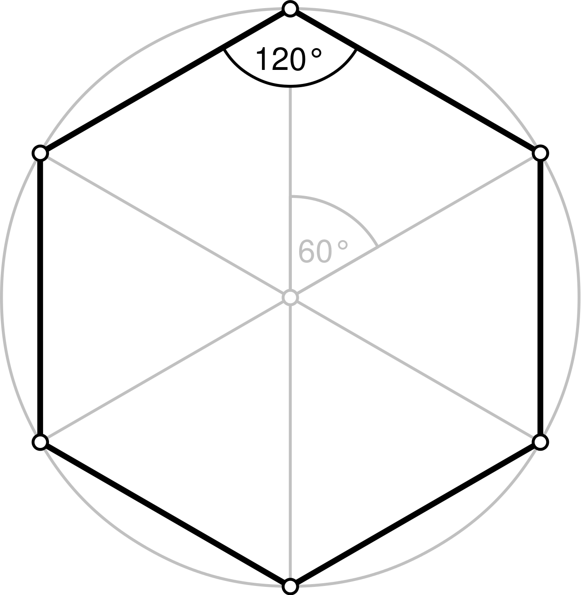

<!-- README.md is generated from README.Rmd. Please edit that file -->

# fosdata <a href='https://github.com/speegled/fosdata'></a>

<!-- badges: start -->

<!-- badges: end -->

The `fosdata` package contains datasets for the textbook [Foundations of
Statistics with R](https://mathstat.slu.edu/~speegle/_book/) by Darrin
Speegle and Bryan Clair.

## Installation

<!--You can install the released version of fosdata from [CRAN](https://CRAN.R-project.org) with:
``` r
install.packages("fosdata")
```
-->

You can install the development version from
[GitHub](https://github.com/) with:

``` r
# install.packages("remotes")
remotes::install_github("speegled/fosdata")
```

## The data

The `fosdata` package contains:

<table>

<thead>

<tr>

<th style="text-align:left;">

Name

</th>

<th style="text-align:left;">

Description

</th>

<th style="text-align:left;">

Dim (RxC)

</th>

</tr>

</thead>

<tbody>

<tr>

<td style="text-align:left;">

accelerometer

</td>

<td style="text-align:left;">

Visual and accelerometer data on workouts

</td>

<td style="text-align:left;">

12245x25

</td>

</tr>

<tr>

<td style="text-align:left;">

bechdel

</td>

<td style="text-align:left;">

The Bechdel test

</td>

<td style="text-align:left;">

1794x15

</td>

</tr>

<tr>

<td style="text-align:left;">

child\_tasks

</td>

<td style="text-align:left;">

Shape Trail Test

</td>

<td style="text-align:left;">

68x13

</td>

</tr>

<tr>

<td style="text-align:left;">

chimps

</td>

<td style="text-align:left;">

Gray haired chimpanzees

</td>

<td style="text-align:left;">

165x159

</td>

</tr>

<tr>

<td style="text-align:left;">

cows

</td>

<td style="text-align:left;">

Cooling down hot cows

</td>

<td style="text-align:left;">

798x9

</td>

</tr>

<tr>

<td style="text-align:left;">

dogs

</td>

<td style="text-align:left;">

Dogs and peer pressure

</td>

<td style="text-align:left;">

351x9

</td>

</tr>

<tr>

<td style="text-align:left;">

frogs

</td>

<td style="text-align:left;">

Frog measurements

</td>

<td style="text-align:left;">

64x16

</td>

</tr>

<tr>

<td style="text-align:left;">

humanization

</td>

<td style="text-align:left;">

Infrahumanization of outgroups

</td>

<td style="text-align:left;">

321x7

</td>

</tr>

<tr>

<td style="text-align:left;">

leg\_strength

</td>

<td style="text-align:left;">

Wii Leg Strength

</td>

<td style="text-align:left;">

30x3

</td>

</tr>

<tr>

<td style="text-align:left;">

leg\_strength\_full

</td>

<td style="text-align:left;">

Wii Leg Strength (full)

</td>

<td style="text-align:left;">

30x17

</td>

</tr>

<tr>

<td style="text-align:left;">

rio\_instagram

</td>

<td style="text-align:left;">

Olympians Instagram Account Data

</td>

<td style="text-align:left;">

226x14

</td>

</tr>

<tr>

<td style="text-align:left;">

skull\_geometry

</td>

<td style="text-align:left;">

Skull Geometry

</td>

<td style="text-align:left;">

56x2

</td>

</tr>

<tr>

<td style="text-align:left;">

weight\_estimate

</td>

<td style="text-align:left;">

Weight lifting judgment in children

</td>

<td style="text-align:left;">

80x7

</td>

</tr>

</tbody>

</table>

## Examples

You can find these and more code examples for exploring fosdata in
`vignette("examples")`.

## License

Need to clarify license information.

## Citation

To cite the fosdata package, please use:

``` r
citation("fosdata")
#> 
#> To cite package 'fosdata' in publications use:
#> 
#>   Darrin Speegle and Bryan Clair (NA). fosdata: Data for use with the
#>   book, Foundations of Statistics with R, by Darrin Speegle and Bryan
#>   Clair. R package version 0.1.0.
#> 
#> A BibTeX entry for LaTeX users is
#> 
#>   @Manual{,
#>     title = {fosdata: Data for use with the book, Foundations of Statistics with R, by Darrin Speegle and Bryan Clair},
#>     author = {Darrin Speegle and Bryan Clair},
#>     note = {R package version 0.1.0},
#>   }
#> 
#> ATTENTION: This citation information has been auto-generated from the
#> package DESCRIPTION file and may need manual editing, see
#> 'help("citation")'.
```

## References

**Data citations:**

It would be good to automatically generate this information from the
package.
